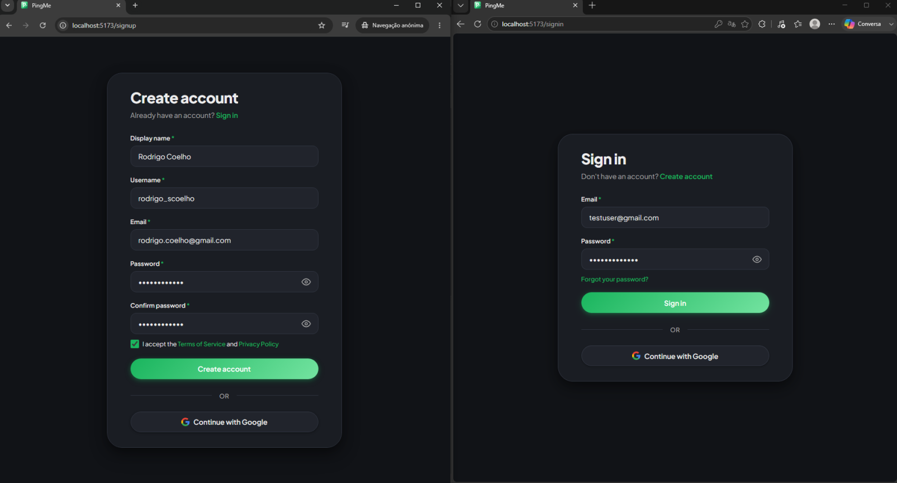
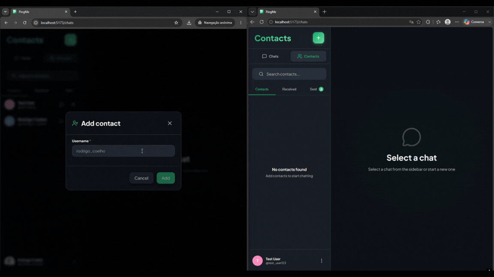
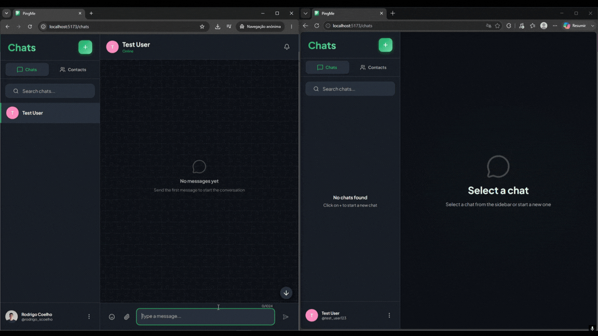
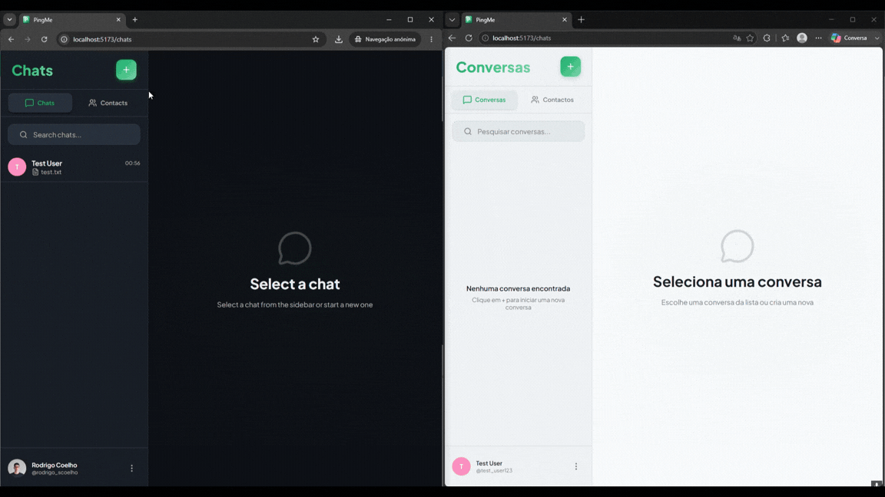
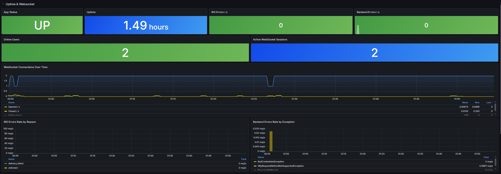
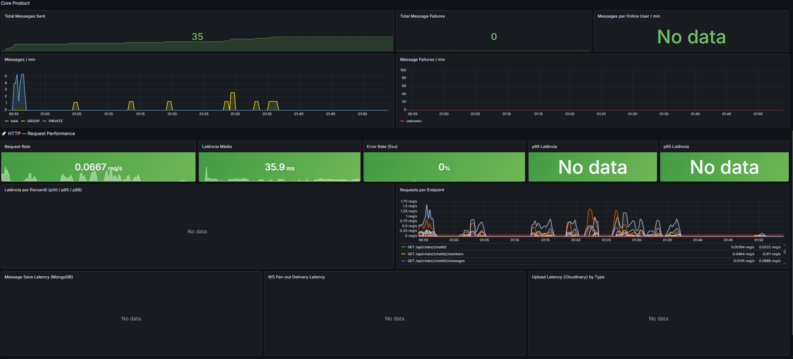
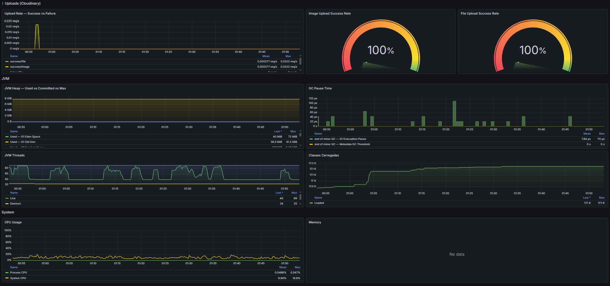
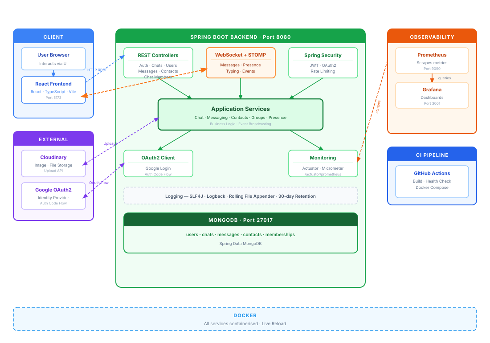
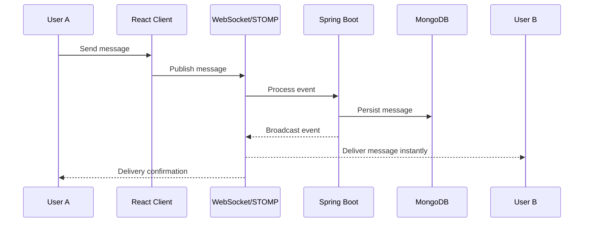

<p align="center" style="background-color: rgba(24, 20, 20, 0.67); padding: 20px;">
  
</p>

<p>
  
  
  
  
  
  
  
  
  
  
  
  
  
</p>

> [!NOTE]
> PingMe is a full-stack real-time messaging application built with Spring Boot, React, WebSockets, and MongoDB. The project focuses on real-time communication, authentication, observability, and production-oriented development practices such as testing, monitoring, logging, and CI automation.

## 🎯 Project Overview

PingMe was designed to explore the architectural and engineering challenges involved in building a modern real-time application.

### Key areas explored

- Real-time communication using **WebSockets and STOMP**
- **MongoDB** and **NoSQL** data modeling
- **Google OAuth2** integration with Spring Security
- Comprehensive **integration testing**
- Application **observability and monitoring**
- **Rate limiting** and application security
- Git-based development workflows
- **CI pipeline** automation
- Application logging and diagnostics using **SLF4J and Logback**

## 🖼️ Application Preview

### Authentication

<p align="center">
  
</p>

### Contacts

<p align="center">
  
</p>

### Private Chat

<p align="center">
  
</p>

### Group Chat

<p align="center">
  
</p>

### Monitoring Dashboard

<p align="center">
  
</p>
<p align="center">
  
</p>
<p align="center">
  
</p>

## 🏗️ Project Architecture

<p align="center">
  
</p>

## 🚀 Features

### 💬 Real-Time Messaging

- WebSocket-powered communication
	- Send and receive messages instantly
	- Edit and delete previously sent messages
- Support for text, image, and file messages
- Real-time notification sounds
- Unread message indicators
- Real-time typing indicators

---

### 👥 Contacts Management

- Add contacts/friends in real time
- Instant synchronization across connected clients
- Event-driven updates

---

### 🟢 Online Presence

- Live online/offline (last seen) status
- Presence synchronization in real time
- Instant updates when users connect or disconnect

---

### 👨‍👩‍👧‍👦 Group Chats

- Create group conversations
- Transfer ownership
- Promote members to moderators
- Demote moderators
- Remove members from groups
- Manage group roles and permissions
- Instant synchronization of membership changes across connected clients
- Automatic system-generated messages for:
  - Group management actions
  - Membership updates
  - Ownership transfers
  - Role changes


## 🔐 Authentication & Security

### Authentication Methods

- Local Sign Up / Sign In
- Google OAuth2 Login

### Security Highlights

- JWT-based stateless authentication
- OAuth2 integration with Google
- WebSocket connection authentication
- Rate limiting protection
- Role-based authorization

## 📊 Observability & Diagnostics

PingMe includes a monitoring and logging stack to provide visibility into application performance, health, and runtime behavior.

### Technologies

- Spring Boot Actuator
- Micrometer
- Prometheus
- Grafana
- SLF4J
- Logback

### Features

- HTTP request, JVM, memory, and CPU metrics
- Application health monitoring
- WebSocket and custom application metrics
- Structured application logging
- Rolling log files with daily rotation
- 30-day log retention
- Enhanced debugging and troubleshooting


## 🔄 Real-Time Event Architecture

PingMe uses dedicated WebSocket channels for different event categories:

| Path | Purpose |
|---------|---------|
| `/queue/messages` | Real-time chat messages |
| `/queue/events` | Contact updates, group events, system events |
| `/queue/presence` | Online/offline presence |
| `/topic/chat/{chatId}/typing` | Typing indicators |

This separation keeps event traffic organized and allows clients to subscribe only to the updates they require.

### Real-Time Message Flow



## 🔁 CI Pipeline

PingMe includes a Continuous Integration pipeline designed to simulate a real-world development workflow.

### CI Responsibilities

- Build verification
- Automated test execution
- Pull request validation
- Early integration issue detection


## ⚙️ Getting Started
 
### Prerequisites
 
- [Docker](https://www.docker.com/) and Docker Compose
### 1. Clone the repository
 
```bash
git clone https://github.com/RodrigoCoelhoo/pingme.git
cd pingme
```
 
### 2. Configure environment variables

Create a `.env` file inside the `frontend/` and `backend/` directory:
 
```bash
cp frontend/.env.example frontend/.env
cp backend/.env.example backend/.env
```
 
Then fill in the required values:
 
```properties
# Cloudinary (https://cloudinary.com)
CLOUDINARY_CLOUD_NAME=your_cloud_name
CLOUDINARY_API_KEY=your_api_key
CLOUDINARY_API_SECRET=your_api_secret
 
# Google OAuth2 (https://console.cloud.google.com)
GOOGLE_CLIENT_ID=your_client_id
GOOGLE_CLIENT_SECRET=your_client_secret
```
 
**Cloudinary** - used for image uploads. Create a free account and grab the credentials from your dashboard.
 
**Google OAuth2** - used for google login. Create a project in Google Cloud Console, enable the Google+ API, and add:
- `http://localhost:5173` as an authorised javascript origin URI
- `http://localhost:8080/api/auth/google/callback` as an authorised redirect URI.
 
### 3. Start the application
 
```bash
docker compose -f docker-compose.dev.yml up --build
```
 
| Service       | URL                          |
|---------------|------------------------------|
| Frontend      | http://localhost:5173        |
| Backend API   | http://localhost:8080        |
| Mongo Express | http://localhost:8081        |
 
### 📈 Observability
 
PingMe exposes metrics via Spring Actuator + Micrometer, scraped by Prometheus and visualised in Grafana.
 
### 1. Start the observability container
 
```bash
cd monitoring
docker compose -f docker-compose.yml up -d
```
 
| Service    | URL                   | Credentials      |
|------------|-----------------------|------------------|
| Prometheus | http://localhost:9090 | ---------------- |
| Grafana    | http://localhost:3001 | admin / admin    |
| Actuator   | http://localhost:8080/actuator | ---------------- |
 
### 2. Add Prometheus as a data source

1. Open Grafana at http://localhost:3001
2. Go to **Connections → Data sources → Add new data source**
3. Select **Prometheus**
4. Set the URL to `http://prometheus:9090`
5. Click **Save & test**

### 3. Import the dashboard
 
1. Go to **Dashboards → New → Import**
2. Upload the file at `monitoring/grafana-dashboard.json`
3. Select the Prometheus data source and click **Import**